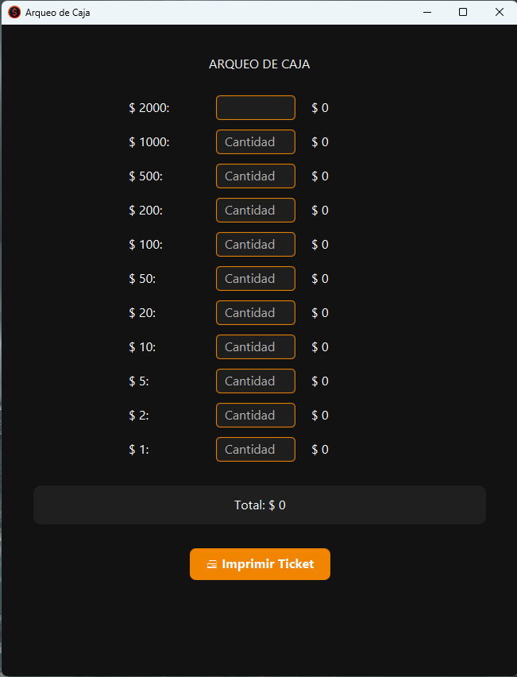
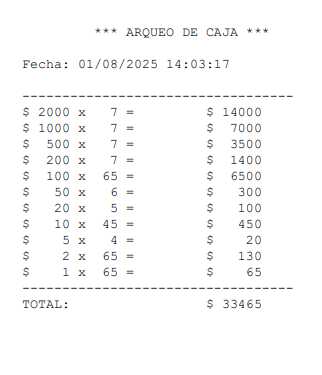

# 🧾 Arqueo de Caja

Aplicación de escritorio desarrollada en **Java + JavaFX** para realizar el arqueo de caja de manera sencilla y rápida.  
Diseñada con una interfaz moderna y clara.

---

## 🚀 Características

- **Interfaz moderna y responsive** (JavaFX + CSS)
- **Actualización automática del total** sin necesidad de botones
- **Subtotales por denominación** para cada billete/moneda
- **Impresión directa** en impresora térmica de 80 mm, con fecha y hora
- **Validación de datos**: solo se aceptan números
- **Diseño limpio** optimizado para uso en pantallas grandes

---

## 🖼 Capturas de Pantalla

### Pantalla principal


### Ticket de impresión


---

## 🛠 Tecnologías utilizadas

- **Java 17+**
- **JavaFX 21+**
- **CSS personalizado para JavaFX**
- **PrinterJob API** para impresión nativa

---

## 📦 Cómo ejecutar

1. Instalar [Java JDK](https://adoptium.net/) y [JavaFX](https://openjfx.io/)
2. Clonar el repositorio:

   ```bash
   git clone https:/jonathanandino/github.com//ArqueoCajaApp.git
